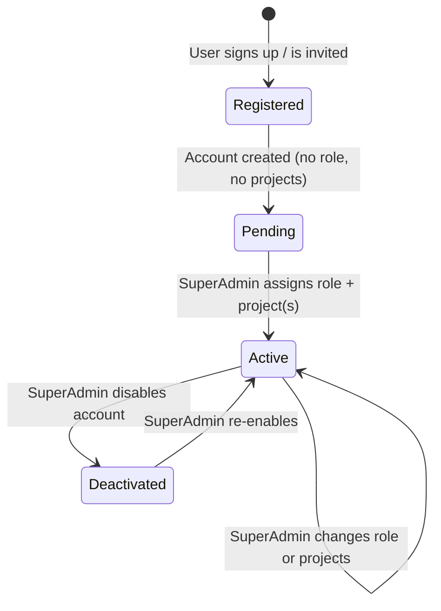
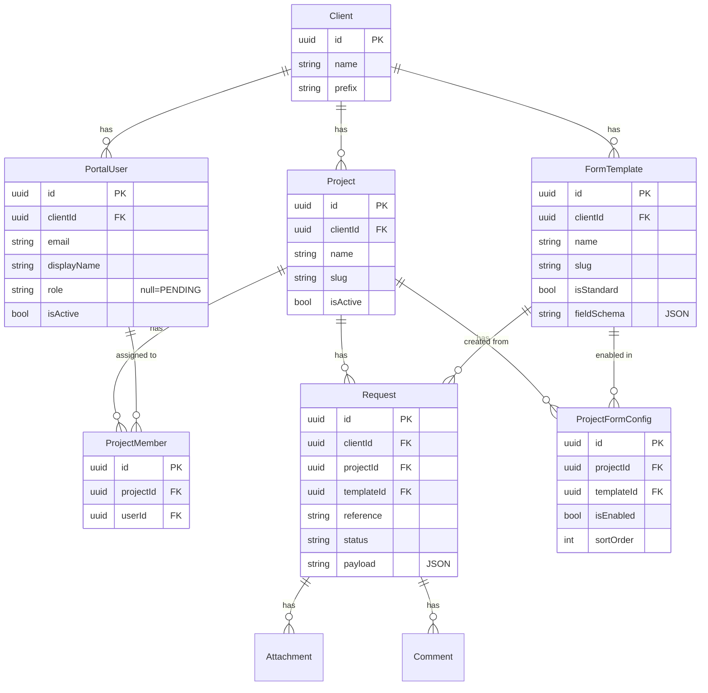

# Roles, Permissions & Multi-Project Isolation — Implementation Plan

## Problem Statement

Currently the platform has **no role system** — every authenticated user has identical access. There's also **no project isolation** — all requests live under a single `Client` entity, meaning people working on Bell Legal Group tickets can see Stonebridge tickets and vice versa. There is no admin interface to manage any of this.

**What we need:**
1. **Roles**: SuperAdmin, Admin, Agent, Client — each with different permissions
2. **Projects**: Isolated workspaces (e.g., "BLG - Power BI", "Stonebridge") under a Client (tenant)
3. **Assignment**: SuperAdmin assigns roles and projects to users **after** they register
4. **Control Panel**: A back-office section where SuperAdmin manages users, projects, and forms
5. **Per-project forms**: SuperAdmin can configure which request forms exist for each project

---

## Key Design Decisions

> [!IMPORTANT]
> **This plan follows the existing architecture rules exactly:**
> - No AI features — pure deterministic RBAC
> - Business logic in `Modules/`, never in adapters
> - Roles/permissions are **backend-enforced** (server = source of truth)
> - Frontend validation is UX only
> - Database-portable (no Postgres-only SQL)
> - Files < 300 lines, one feature per module

### Terminology

| Term | Meaning |
|------|---------|
| **Client** (tenant) | The organization (e.g., "Provana"). Already exists in schema. |
| **Project** | A workspace within a Client (e.g., "BLG - Power BI", "Stonebridge"). **NEW.** |
| **Role** | What a user can do: SuperAdmin, Admin, Agent, or Client. |
| **Agent** | Internal team member who works tickets (your BI developers). |
| **Client User** | External customer who submits and tracks their own requests. |
| **Form Template** | A request form type configured per project by the SuperAdmin. **NEW.** |

### Role Hierarchy

```
SuperAdmin ─── Full control: manages clients, projects, users, forms
    │
    Admin ──── Manages one client: projects, users, forms within their tenant
    │
    Agent ──── Works tickets in assigned projects (internal team)
    │
    Client ─── Submits & tracks own requests in assigned projects (external user)
```

### User Lifecycle



> [!IMPORTANT]
> **Users who register cannot do anything until a SuperAdmin assigns them a role and at least one project.** They see a "Pending approval" screen after login. This ensures no unauthorized access.

---

## Permission Matrix

| Action | SuperAdmin | Admin | Agent | Client |
|--------|-----------|-------|-------|--------|
| **Control Panel** | | | | |
| Access Control Panel | ✅ | ✅ (limited) | ❌ | ❌ |
| **Clients** | | | | |
| Create/edit/delete clients | ✅ | ❌ | ❌ | ❌ |
| List all clients | ✅ | ❌ | ❌ | ❌ |
| **Projects** | | | | |
| Create/edit/delete projects | ✅ | ✅ own client | ❌ | ❌ |
| List projects | ✅ all | ✅ own client | ✅ assigned only | ✅ assigned only |
| **Form Templates** | | | | |
| Create/edit form templates | ✅ | ✅ own client | ❌ | ❌ |
| Enable/disable forms per project | ✅ | ✅ own client | ❌ | ❌ |
| **Users** | | | | |
| View all users | ✅ all | ✅ own client | ❌ | ❌ |
| Assign role | ✅ any role | ✅ Admin/Agent/Client only | ❌ | ❌ |
| Assign to projects | ✅ | ✅ own client | ❌ | ❌ |
| Activate/deactivate users | ✅ | ✅ own client | ❌ | ❌ |
| **Requests** | | | | |
| Create requests | ✅ | ✅ | ✅ assigned projects | ✅ assigned projects |
| View requests | ✅ all | ✅ own client | ✅ assigned projects | ✅ own only |
| Update status | ✅ | ✅ own client | ✅ assigned projects | ❌ |
| **Attachments & Comments** | | | | |
| Upload/download | ✅ | ✅ own client | ✅ assigned projects | ✅ own requests |
| View internal comments | ✅ | ✅ | ✅ | ❌ |

---

## SuperAdmin Control Panel — UI Design

### Entry Point

The SuperAdmin accesses the Control Panel by **clicking their name** in the top navigation bar. For Admin+ roles, the profile dropdown shows an extra **"Control Panel"** option:

```
┌─────────────────────────────────────────────────────────┐
│  🟣 Provana Help Center          🔍     👤 Carlos ▾    │
│                                         ┌──────────────┐│
│                                         │ My Profile   ││
│                                         │ ─────────────││
│                                         │ ⚙ Control    ││
│                                         │   Panel      ││
│                                         │ ─────────────││
│                                         │ ↪ Sign Out   ││
│                                         └──────────────┘│
└─────────────────────────────────────────────────────────┘
```

### Control Panel Layout

The Control Panel is a **separate section** with its own sidebar navigation:

```
┌──────────────────────────────────────────────────────────────────┐
│  ⚙ Control Panel                            ← Back to Portal   │
├──────────┬───────────────────────────────────────────────────────┤
│          │                                                       │
│  📊 Overview   │  Dashboard with summary stats                  │
│          │     │  • 12 Users  • 3 Projects  • 47 Requests       │
│  👥 Users│     │  • 2 Pending approval                          │
│          │                                                       │
│  📁 Projects   │                                                │
│          │                                                       │
│  📝 Forms│                                                       │
│          │                                                       │
│  📋 Audit│                                                       │
│   Log    │                                                       │
│          │                                                       │
└──────────┴───────────────────────────────────────────────────────┘
```

### Control Panel — Users Section

```
┌──────────────────────────────────────────────────────────────────┐
│  👥 Users                                    [+ Invite User]    │
├──────────────────────────────────────────────────────────────────┤
│  ⚠ 2 users pending approval                                     │
│  ┌────────────────────────────────────────────────────────────┐  │
│  │ 👤 María García         │ maria@blg.com     │ ⏳ PENDING  │  │
│  │   Registered: May 28    │ No role assigned   │ [Set Up →] │  │
│  ├────────────────────────────────────────────────────────────┤  │
│  │ 👤 John Smith           │ john@stone.com     │ ⏳ PENDING  │  │
│  │   Registered: May 29    │ No role assigned   │ [Set Up →] │  │
│  └────────────────────────────────────────────────────────────┘  │
│                                                                  │
│  Active Users                                    Filter: [All ▾]│
│  ┌────────────────────────────────────────────────────────────┐  │
│  │ 👤 Carlos Ruiz   │ carlos@provana │ SUPER_ADMIN │ All     │  │
│  │ 👤 Ana López     │ ana@provana    │ ADMIN       │ All     │  │
│  │ 👤 Pedro Díaz    │ pedro@provana  │ AGENT       │ BLG     │  │
│  │ 👤 Laura Chen    │ laura@blg.com  │ CLIENT      │ BLG     │  │
│  └────────────────────────────────────────────────────────────┘  │
└──────────────────────────────────────────────────────────────────┘
```

### Control Panel — User Setup / Edit Modal

When SuperAdmin clicks **[Set Up →]** or edits a user:

```
┌─────────────────────────────────────────────┐
│  Configure User: María García               │
│  maria@blg.com                              │
│                                             │
│  Role                                       │
│  ┌─────────────────────────────────────┐    │
│  │ ○ Client   — Submits requests      │    │
│  │ ○ Agent    — Works on tickets      │    │
│  │ ○ Admin    — Manages a client      │    │
│  │ ○ SuperAdmin — Full control        │    │
│  └─────────────────────────────────────┘    │
│                                             │
│  Assign to Projects                         │
│  ┌─────────────────────────────────────┐    │
│  │ ☑ BLG - Power BI Requests          │    │
│  │ ☐ Stonebridge                      │    │
│  │ ☐ BLG - Neodeluxe                  │    │
│  └─────────────────────────────────────┘    │
│                                             │
│         [Cancel]          [Save & Activate] │
└─────────────────────────────────────────────┘
```

### Control Panel — Projects Section

```
┌──────────────────────────────────────────────────────────────────┐
│  📁 Projects                                 [+ New Project]    │
├──────────────────────────────────────────────────────────────────┤
│  ┌────────────────────────────────────────────────────────────┐  │
│  │ 📁 BLG - Power BI Requests                                │  │
│  │   5 members • 23 requests • 4 form types enabled          │  │
│  │   [Manage Members]  [Configure Forms]  [Edit]  [Archive]  │  │
│  ├────────────────────────────────────────────────────────────┤  │
│  │ 📁 Stonebridge                                             │  │
│  │   3 members • 18 requests • 3 form types enabled          │  │
│  │   [Manage Members]  [Configure Forms]  [Edit]  [Archive]  │  │
│  ├────────────────────────────────────────────────────────────┤  │
│  │ 📁 BLG - Neodeluxe                        (coming soon)   │  │
│  │   0 members • 0 requests • not configured                 │  │
│  │   [Manage Members]  [Configure Forms]  [Edit]  [Archive]  │  │
│  └────────────────────────────────────────────────────────────┘  │
└──────────────────────────────────────────────────────────────────┘
```

### Control Panel — Project Form Configuration

When SuperAdmin clicks **[Configure Forms]** on a project:

```
┌──────────────────────────────────────────────────────────────────┐
│  📝 Form Templates for: BLG - Power BI Requests                │
├──────────────────────────────────────────────────────────────────┤
│                                                                  │
│  Enabled Forms                                                   │
│  ┌────────────────────────────────────────────────────────────┐  │
│  │ ☑ Create New Report     │ Standard template  │ [Edit ✏️]  │  │
│  │ ☑ Request New Page      │ Standard template  │ [Edit ✏️]  │  │
│  │ ☑ Request New Feature   │ Standard template  │ [Edit ✏️]  │  │
│  │ ☑ Fix an Issue          │ Standard template  │ [Edit ✏️]  │  │
│  │ ☐ View Request Status   │ Standard template  │ [Edit ✏️]  │  │
│  └────────────────────────────────────────────────────────────┘  │
│                                                                  │
│  Custom Forms                                [+ Create New Form] │
│  ┌────────────────────────────────────────────────────────────┐  │
│  │ ☑ Data Access Request   │ Custom (3 fields)  │ [Edit ✏️]  │  │
│  │ ☑ Dashboard Retirement  │ Custom (5 fields)  │ [Edit ✏️]  │  │
│  └────────────────────────────────────────────────────────────┘  │
│                                                                  │
└──────────────────────────────────────────────────────────────────┘
```

### Control Panel — Form Builder (Create/Edit Custom Forms)

```
┌──────────────────────────────────────────────────────────────────┐
│  📝 Edit Form: Data Access Request                              │
├──────────────────────────────────────────────────────────────────┤
│                                                                  │
│  Form Name: [Data Access Request          ]                     │
│  Description: [Request access to specific data sources    ]     │
│                                                                  │
│  Fields                                          [+ Add Field]  │
│  ┌────────────────────────────────────────────────────────────┐  │
│  │ ⠿ 1. Report Name     │ Text     │ Required ☑ │ [🗑️]     │  │
│  │ ⠿ 2. Data Source      │ Text     │ Required ☑ │ [🗑️]     │  │
│  │ ⠿ 3. Justification    │ Textarea │ Required ☑ │ [🗑️]     │  │
│  │ ⠿ 4. Priority         │ Select   │ Required ☑ │ [🗑️]     │  │
│  │     Options: Low, Medium, High, Urgent                     │  │
│  │ ⠿ 5. Requested By     │ Date     │ Optional ☐ │ [🗑️]     │  │
│  └────────────────────────────────────────────────────────────┘  │
│  ⠿ = drag to reorder                                           │
│                                                                  │
│  Field Types Available:                                          │
│  Text, Textarea, Select (dropdown), Date, Email, Number         │
│                                                                  │
│              [Cancel]       [Preview]       [Save Template]     │
└──────────────────────────────────────────────────────────────────┘
```

---

## Database Schema Changes

### New Models (Prisma)

```prisma
// ── Projects ──────────────────────────────────────────────────────────────
model Project {
  id          String   @id @default(uuid()) @db.Uuid
  clientId    String   @map("client_id") @db.Uuid
  name        String   @db.VarChar(128)
  slug        String   @db.VarChar(64)
  description String?  @db.Text
  isActive    Boolean  @default(true) @map("is_active")
  createdAt   DateTime @default(now()) @map("created_at")
  updatedAt   DateTime @updatedAt @map("updated_at")

  client      Client            @relation(fields: [clientId], references: [id])
  members     ProjectMember[]
  requests    Request[]
  formConfigs ProjectFormConfig[]

  @@unique([clientId, slug])
  @@map("projects")
}

// ── Project Membership ────────────────────────────────────────────────────
model ProjectMember {
  id        String   @id @default(uuid()) @db.Uuid
  projectId String   @map("project_id") @db.Uuid
  userId    String   @map("user_id") @db.Uuid
  createdAt DateTime @default(now()) @map("created_at")

  project   Project    @relation(fields: [projectId], references: [id])
  user      PortalUser @relation(fields: [userId], references: [id])

  @@unique([projectId, userId])
  @@map("project_members")
}

// ── Form Templates ────────────────────────────────────────────────────────
// A reusable form definition. Standard templates are seeded; custom ones are
// created by SuperAdmin/Admin. The field schema is stored as JSON text
// (portable to SQL Server nvarchar(max)).
model FormTemplate {
  id          String   @id @default(uuid()) @db.Uuid
  clientId    String   @map("client_id") @db.Uuid
  name        String   @db.VarChar(128)        // "Create New Report"
  slug        String   @db.VarChar(64)         // "new-report"
  description String?  @db.Text
  isStandard  Boolean  @default(false) @map("is_standard")  // true = seeded system template
  fieldSchema String   @map("field_schema") @db.Text         // JSON array of field definitions
  createdAt   DateTime @default(now()) @map("created_at")
  updatedAt   DateTime @updatedAt @map("updated_at")

  client      Client              @relation(fields: [clientId], references: [id])
  projects    ProjectFormConfig[]

  @@unique([clientId, slug])
  @@map("form_templates")
}

// ── Per-Project Form Configuration ────────────────────────────────────────
// Which form templates are enabled for which project.
model ProjectFormConfig {
  id         String   @id @default(uuid()) @db.Uuid
  projectId  String   @map("project_id") @db.Uuid
  templateId String   @map("template_id") @db.Uuid
  isEnabled  Boolean  @default(true) @map("is_enabled")
  sortOrder  Int      @default(0) @map("sort_order")
  createdAt  DateTime @default(now()) @map("created_at")

  project    Project      @relation(fields: [projectId], references: [id])
  template   FormTemplate @relation(fields: [templateId], references: [id])

  @@unique([projectId, templateId])
  @@map("project_form_configs")
}
```

### Form Template Field Schema (JSON stored as Text)

```typescript
// Stored as JSON string in FormTemplate.fieldSchema
interface FormFieldDef {
  name:        string;   // "reportName", "dataSource"
  label:       string;   // "Report Name", "Data Source"
  type:        'text' | 'textarea' | 'select' | 'date' | 'email' | 'number';
  required:    boolean;
  placeholder?: string;
  options?:    string[];  // for 'select' type only
  sortOrder:   number;
}

// Example: the standard "Create New Report" form stored as:
[
  { "name": "reportName",  "label": "Report Name",  "type": "text",     "required": true,  "sortOrder": 1 },
  { "name": "description", "label": "Description",  "type": "textarea", "required": true,  "sortOrder": 2 },
  { "name": "dataSources", "label": "Data Sources",  "type": "textarea", "required": false, "sortOrder": 3 },
  { "name": "priority",    "label": "Priority",      "type": "select",   "required": true,  "sortOrder": 4,
    "options": ["Low", "Medium", "High", "Urgent"] },
  { "name": "deadline",    "label": "Deadline",       "type": "date",     "required": false, "sortOrder": 5 }
]
```

### Modified Models

```diff
 model PortalUser {
   id          String   @id @default(uuid()) @db.Uuid
   clientId    String   @map("client_id") @db.Uuid
   authUserId  String   @unique @map("auth_user_id")
   email       String   @db.VarChar(255)
   displayName String   @map("display_name") @db.VarChar(128)
+  role        String?  @db.VarChar(32)                  // null = PENDING (no role assigned yet)
+  isActive    Boolean  @default(true) @map("is_active")
   createdAt   DateTime @default(now()) @map("created_at")
+  updatedAt   DateTime @updatedAt @map("updated_at")

+  projects    ProjectMember[]
+  client      Client @relation(fields: [clientId], references: [id])

   @@map("portal_users")
 }

 model Request {
   // ... existing fields ...
+  projectId    String   @map("project_id") @db.Uuid
+  templateId   String?  @map("template_id") @db.Uuid   // which form template was used

+  project      Project       @relation(fields: [projectId], references: [id])
+  template     FormTemplate? @relation(fields: [templateId], references: [id])
   // ... existing relations ...
 }

 model Client {
   // ... existing fields ...
+  projects      Project[]
+  users         PortalUser[]
+  formTemplates FormTemplate[]
   // ... existing relations ...
 }
```

### ER Diagram



---

## Navigation Flow

```
┌─────────────────────────────────────────────────────────────────┐
│                          LOGIN                                  │
│                            │                                    │
│                    ┌───────┴───────┐                             │
│                    │               │                             │
│              role = null      role assigned                      │
│                    │               │                             │
│           "Pending Approval"  Project Picker                    │
│            (waiting screen)        │                             │
│                            ┌───────┴───────┐                    │
│                            │               │                    │
│                     Select Project   Click Name ▾               │
│                            │               │                    │
│                    Request Dashboard  ┌────┴────┐               │
│                     (forms list)      │         │               │
│                            │       Profile  Control Panel       │
│                     Submit Form        (Admin+ only)            │
│                                        │                        │
│                                  ┌─────┼─────┐─────┐           │
│                                  │     │     │     │            │
│                              Overview Users Projects Forms      │
└─────────────────────────────────────────────────────────────────┘
```

### How Forms Work Now vs. After

**Current** (hardcoded):
```
ViewPortal has PORTALS[] → hardcoded cards → clicks go to hardcoded ViewForm*.tsx
Each form component is a separate React file with hardcoded fields
```

**After** (dynamic):
```
ViewPortal → fetches GET /projects (filtered by user's assignments)
Click project → fetches GET /projects/:id/forms (enabled templates)
Click form → renders a DYNAMIC form from the template's fieldSchema
SuperAdmin creates/edits templates in Control Panel → stored in DB
```

> [!IMPORTANT]
> **The 5 existing hardcoded form components** (`ViewForm.tsx`, `ViewFormNewPage.tsx`, etc.) will be replaced by a **single dynamic form renderer** (`ViewDynamicForm.tsx`) that reads the `fieldSchema` JSON and renders the appropriate fields. The standard templates are seeded during migration with the same fields as the current hardcoded forms — so the user experience doesn't change for existing forms.

---

## Backend Changes

### New Module: `IAM` (Identity & Access Management)

```
backend/src/Modules/IAM/
├── Role.ts                    # Role enum, rank, permission definitions
├── PermissionGuard.ts         # Middleware: check role + project access
├── ProjectEntity.ts           # Project type definitions
├── ProjectService.ts          # CRUD + member management
├── ProjectRepository.ts       # Interface + InMemory
├── PrismaProjectRepository.ts # Prisma implementation
├── ProjectEndpoints.ts        # REST routes for projects
├── UserService.ts             # User management (role assign, activate)
├── UserRepository.ts          # Interface + InMemory
├── PrismaUserRepository.ts    # Prisma implementation
├── UserEndpoints.ts           # REST routes for users
└── __tests__/                 # Unit tests
```

### New Module: `FormTemplates`

```
backend/src/Modules/FormTemplates/
├── FormTemplate.ts             # Entity type + field schema types
├── FormTemplateService.ts      # CRUD templates + validate fieldSchema
├── FormTemplateRepository.ts   # Interface + InMemory
├── PrismaFormTemplateRepository.ts
├── FormTemplateEndpoints.ts    # REST routes
├── FormTemplateValidators.ts   # Zod schema for fieldSchema validation
├── ProjectFormConfigService.ts # Enable/disable templates per project
└── __tests__/
```

### Auth Enhancement

The `UserIdentity` interface gains role and project awareness:

```diff
 export interface UserIdentity {
   userId:      string;
   clientId:    string;
   email:       string;
   displayName: string;
+  role:        string | null;    // null = PENDING (not yet approved)
+  projectIds:  string[];         // projects the user can access
 }
```

**Role is loaded from the database, NOT from the JWT token.** The auth middleware:

1. `IIdentityProvider.verify(token)` → gets `userId`, `clientId` from token
2. Looks up `PortalUser` in DB → gets `role` and `projectIds`
3. If `role === null` → user is pending, reject with 403 and `"PENDING_APPROVAL"` error

### API Endpoints

#### Projects

| Method | Path | Role | Description |
|--------|------|------|-------------|
| `POST` | `/projects` | Admin+ | Create project |
| `GET` | `/projects` | Any (filtered) | List accessible projects |
| `GET` | `/projects/:id` | Assigned/Admin+ | Project details |
| `PATCH` | `/projects/:id` | Admin+ | Update project |
| `DELETE` | `/projects/:id` | Admin+ | Archive project |
| `POST` | `/projects/:id/members` | Admin+ | Add member |
| `DELETE` | `/projects/:id/members/:userId` | Admin+ | Remove member |
| `GET` | `/projects/:id/members` | Assigned/Admin+ | List members |

#### Users

| Method | Path | Role | Description |
|--------|------|------|-------------|
| `GET` | `/users` | Admin+ | List users (filtered by client) |
| `GET` | `/users/pending` | Admin+ | List pending users |
| `GET` | `/users/me` | Any | Own profile + role + projects |
| `POST` | `/users/invite` | Admin+ | Invite user by email |
| `PATCH` | `/users/:id` | Admin+ | Update role, activate/deactivate |
| `PATCH` | `/users/:id/role` | Admin+ | Assign role |
| `PATCH` | `/users/:id/projects` | Admin+ | Set project assignments |

#### Form Templates

| Method | Path | Role | Description |
|--------|------|------|-------------|
| `GET` | `/form-templates` | Admin+ | List all templates for client |
| `POST` | `/form-templates` | Admin+ | Create custom template |
| `GET` | `/form-templates/:id` | Any | Get template details + fieldSchema |
| `PATCH` | `/form-templates/:id` | Admin+ | Update template |
| `DELETE` | `/form-templates/:id` | Admin+ | Delete custom template (not standard) |
| `GET` | `/projects/:id/forms` | Assigned+ | List enabled forms for a project |
| `PUT` | `/projects/:id/forms` | Admin+ | Set which templates are enabled |

---

## Frontend Changes

### New Views

| View | Purpose | Role |
|------|---------|------|
| `ViewPendingApproval` | "Your account is pending approval" screen | Pending users |
| `ViewProjectPicker` | Dynamic project selection (replaces hardcoded cards) | All active |
| `ViewDynamicForm` | Renders any form from a fieldSchema | All active |
| `ViewControlPanel` | Control Panel shell with sidebar navigation | Admin+ |
| `ViewCPOverview` | Dashboard: stats, pending users count | Admin+ |
| `ViewCPUsers` | User list + setup/edit modal | Admin+ |
| `ViewCPProjects` | Project list + CRUD | Admin+ |
| `ViewCPProjectMembers` | Manage project members | Admin+ |
| `ViewCPForms` | Form template list per project | Admin+ |
| `ViewCPFormBuilder` | Create/edit form template (field editor) | Admin+ |

### Auth Context Enhancement

```typescript
export interface UserSession {
  userId:      string;
  email:       string;
  displayName: string;
  accessToken: string;
  role:        Role | null;       // null = pending
  projects:    ProjectSummary[];  // assigned projects
}

interface AppState {
  user:          UserSession | null;
  activeProject: ProjectSummary | null;  // currently selected project
  setActiveProject(p: ProjectSummary): void;
  // ...
}
```

### Dynamic Form Renderer

A single component that replaces all 5 hardcoded form views:

```typescript
// ViewDynamicForm.tsx
// Receives a FormTemplate with fieldSchema
// Renders fields dynamically based on type
// Validates based on required flags
// Submits to POST /requests with templateId + payload

function ViewDynamicForm({ template }: { template: FormTemplate }) {
  const fields: FormFieldDef[] = JSON.parse(template.fieldSchema);

  return (
    <form onSubmit={handleSubmit}>
      {fields
        .sort((a, b) => a.sortOrder - b.sortOrder)
        .map(field => (
          <DynamicField key={field.name} field={field} />
        ))}
      <button type="submit">Submit Request</button>
    </form>
  );
}

// DynamicField renders the correct input based on field.type:
// text     → <input type="text" />
// textarea → <textarea />
// select   → <select><option>...</select>
// date     → <input type="date" />
// email    → <input type="email" />
// number   → <input type="number" />
```

---

## 🐛 Known Bugs — To Fix During Implementation

### Critical (App-Breaking)

| # | Bug | Location | Impact | Fix Strategy | Phase |
|---|-----|----------|--------|--------------|-------|
| 1 | **Login doesn't work** — `ViewLogin` calls `auth.signIn()` successfully but never updates `user` state in `AppContext`. No `setUser` is exposed by the context. | [ViewLogin.tsx:18](file:///C:/Users/yosman/Documents/requeriments/frontend/src/views/ViewLogin.tsx#L18), [AppContext.tsx](file:///C:/Users/yosman/Documents/requeriments/frontend/src/context/AppContext.tsx) | **App is unusable** — cannot get past login screen | Expose `setUser` from `AppContext`. `ViewLogin.handleSubmit` calls `setUser(session)` after `auth.signIn()` succeeds, then `go('portal')`. | **Phase E** (Task 016) |
| 2 | **`go('portal')` is a no-op** — the navigation guard `if (next === view && !params?.id) return` blocks navigation when the view is already `'portal'` (which is the default). | [AppContext.tsx:31](file:///C:/Users/yosman/Documents/requeriments/frontend/src/context/AppContext.tsx#L31) | Compounds Bug #1 — even if `setUser` were called, the view wouldn't change | Remove the early-return guard for the same-view case, or change the default view for unauthenticated users to `'login'` instead of `'portal'`. Since we're adding a Project Picker flow, the initial authenticated view will change anyway. | **Phase E** (Task 016) |

### Medium (Poor UX / Missing Functionality)

| # | Bug | Location | Impact | Fix Strategy | Phase |
|---|-----|----------|--------|--------------|-------|
| 3 | **No favicon** → 404 error in console on every page load | [index.html](file:///C:/Users/yosman/Documents/requeriments/frontend/index.html) | Console noise, unprofessional in dev tools | Add a `<link rel="icon">` to `index.html` pointing to the existing `assets/provana-logo.png` or a derived `.ico` / `.svg` favicon. | **Phase E** (Task 016) |
| 4 | **No error boundaries** — any React error crashes the entire app with a white screen, no recovery possible | All views | Users lose their work and see a blank page; no way to recover without refreshing | Add a top-level `<ErrorBoundary>` component wrapping `<Router>` in `App.tsx`. Shows a "Something went wrong" screen with a "Go back" button. Add per-view boundaries around data-fetching views. | **Phase E** (Task 016) |
| 5 | **No loading states** on most data-fetching views — blank UI while API calls are in flight | [ViewRequestsList.tsx](file:///C:/Users/yosman/Documents/requeriments/frontend/src/views/ViewRequestsList.tsx), [ViewRequestDetail.tsx](file:///C:/Users/yosman/Documents/requeriments/frontend/src/views/ViewRequestDetail.tsx) | Users see empty content and think the app is broken | Add loading spinners / skeleton UI to all views that fetch data on mount. Create a reusable `<LoadingSpinner>` component. | **Phase E** (Task 016) |

### Low (Hardening / Polish)

| # | Bug | Location | Impact | Fix Strategy | Phase |
|---|-----|----------|--------|--------------|-------|
| 6 | **Webhook replay vulnerability** — no timestamp/nonce validation on GitHub webhooks; HMAC is verified but the same signed payload could theoretically be replayed | [WebhookEndpoints.ts](file:///C:/Users/yosman/Documents/requeriments/backend/src/Modules/Sync/SyncEndpoints.ts) | Theoretical replay attacks (low real-world risk since webhooks are idempotent) | Add delivery ID tracking: store `X-GitHub-Delivery` header in a Set/table, reject duplicates. GitHub already sends unique IDs per delivery. | **Phase B** (Task 013) — alongside backend hardening |
| 7 | **No rate limiting** on any backend endpoint | [app.ts](file:///C:/Users/yosman/Documents/requeriments/backend/src/app.ts) | DoS risk — any client can flood the server | Add `@fastify/rate-limit` plugin with sensible defaults (e.g., 100 req/min per IP). Stricter limits on `POST /requests` and auth endpoints. | **Phase A** (Task 012) — as part of backend foundation |
| 8 | **No responsive/mobile CSS** — the layout breaks on screens narrower than ~900px | [index.css](file:///C:/Users/yosman/Documents/requeriments/frontend/src/index.css) | Poor mobile UX — unusable on phones/tablets | Add CSS media queries for breakpoints (768px, 480px). Collapse sidebar on mobile, stack cards vertically, adjust form widths. Especially important for the new Control Panel. | **Phase G** (Task 018) — alongside Control Panel UI |
| 9 | **Confusing naming**: `ViewRequests` vs `ViewRequestsList` — two separate components that appear to do similar things | [views/](file:///C:/Users/yosman/Documents/requeriments/frontend/src/views) | Developer confusion, potential dead code | During the frontend refactor, consolidate into a single `ViewRequestsList`. Remove unused `ViewRequests` component. Update the view router. | **Phase F** (Task 017) — alongside form/view cleanup |

### Bug Fix Integration Map

```mermaid
gantt
    title Bug Fixes Mapped to Implementation Phases
    dateFormat X
    axisFormat %s

    section Phase A (Task 012)
    #7 Rate limiting         :a7, 0, 1

    section Phase B (Task 013)
    #6 Webhook replay guard  :a6, 1, 2

    section Phase E (Task 016)
    #1 Login broken (setUser) :crit, a1, 4, 5
    #2 go() no-op guard       :crit, a2, 4, 5
    #3 Missing favicon        :a3, 4, 5
    #4 Error boundaries       :a4, 4, 5
    #5 Loading states         :a5, 4, 5

    section Phase F (Task 017)
    #9 Consolidate views     :a9, 5, 6

    section Phase G (Task 018)
    #8 Responsive CSS        :a8, 6, 7
```



> [!CAUTION]
> **Bugs #1 and #2 are blocking** — the app literally cannot be used without fixing them. They are scheduled as the **first items** in Phase E (Task 016), before any new UI work begins. The current workaround is to manually set `sessionStorage.setItem('access_token', 'demo-token')` in the browser console and refresh.

---

## Implementation Phases

### Phase A: Schema + Role Foundation (Task 012)
- Prisma schema: add `Project`, `ProjectMember`, `FormTemplate`, `ProjectFormConfig`
- Modify `PortalUser` (add `role`, `isActive`)
- Modify `Request` (add `projectId`, `templateId`)
- Create `Role.ts` with enum + rank + permission checks
- Create `PermissionGuard.ts` middleware
- Write migration
- Seed standard form templates
- 🐛 **Fix #7**: Add `@fastify/rate-limit` to `app.ts`
- Unit tests for permission logic

### Phase B: Project CRUD + Members (Task 013)
- `ProjectService`, `ProjectRepository`, `ProjectEndpoints`
- Member management: add/remove users to projects
- Tenant isolation tests
- 🐛 **Fix #6**: Add webhook delivery-ID dedup (reject replayed GitHub webhooks)
- Role enforcement tests

### Phase C: User Management + Pending Approval (Task 014)
- `UserService`, `UserRepository`, `UserEndpoints`
- Role assignment endpoint
- Project assignment endpoint
- Pending user flow: `GET /users/pending`, `PATCH /users/:id/role`
- `GET /users/me` for self-profile
- Auth middleware: reject pending users with descriptive error

### Phase D: Form Templates + Configuration (Task 015)
- `FormTemplateService`, `FormTemplateRepository`, `FormTemplateEndpoints`
- Seed 5 standard templates matching current hardcoded forms
- `ProjectFormConfigService`: enable/disable per project
- `fieldSchema` validation with Zod
- Tests: create custom template, enable in project, list enabled forms

### Phase E: Frontend — Fix Login + Roles + Project Picker (Task 016)
- 🐛 **Fix #1**: Expose `setUser` from `AppContext` → call it in `ViewLogin.handleSubmit` after successful `signIn()`
- 🐛 **Fix #2**: Fix `go()` navigation guard — change default unauthenticated view to `'login'` instead of `'portal'`
- 🐛 **Fix #3**: Add favicon `<link>` to `index.html` using the existing Provana logo
- 🐛 **Fix #4**: Add `<ErrorBoundary>` component wrapping `<Router>` in `App.tsx` with recovery UI
- 🐛 **Fix #5**: Add `<LoadingSpinner>` component + loading states to `ViewRequestsList` and `ViewRequestDetail`
- Add `role`, `projects` to auth flow
- `ViewPendingApproval` screen for users with `role === null`
- `ViewProjectPicker` with dynamic project cards from API
- Active project context
- Role-based nav: show/hide "Control Panel" in dropdown

### Phase F: Frontend — Dynamic Form Renderer (Task 017)
- `ViewDynamicForm` component (replaces 5 hardcoded form views)
- `DynamicField` component (renders by field type)
- Fetch enabled forms per project from API
- Submit with `templateId` + dynamic payload
- 🐛 **Fix #9**: Consolidate `ViewRequests` and `ViewRequestsList` into a single component; remove dead code
- Keep hardcoded forms as fallback until migration is verified

### Phase G: Frontend — Control Panel (Task 018)
- Control Panel shell with sidebar
- `ViewCPOverview` (stats dashboard)
- `ViewCPUsers` (list + setup/edit modal with role + project assignment)
- `ViewCPProjects` (list + create/edit)
- `ViewCPProjectMembers` (assign/remove members)
- `ViewCPForms` (enable/disable templates per project)
- `ViewCPFormBuilder` (create/edit custom form templates with drag-and-drop field editor)
- 🐛 **Fix #8**: Add responsive CSS with media queries (768px, 480px breakpoints) — applies to entire app including Control Panel

---

## Demo Mode Updates

For `AUTH_PROVIDER=local`, the system seeds:

| Entity | Demo Data |
|--------|-----------|
| **Client** | "Provana" |
| **Projects** | "BLG - Power BI Requests", "Stonebridge", "BLG - Neodeluxe" |
| **Users** | Demo SuperAdmin (all projects), Demo Agent (BLG only), Demo Client (Stonebridge only) |
| **Form Templates** | 5 standard templates + 1 custom "Data Access Request" |
| **Project Forms** | BLG: all 5 standard enabled. Stonebridge: 3 standard + 1 custom enabled. |

The demo login button shows a **role picker** so you can test each role:

```
┌───────────────────────────────────────┐
│  Demo Mode — Choose a role to test:   │
│                                       │
│  [🔑 SuperAdmin]  — Full control      │
│  [👔 Admin]       — Manage projects   │
│  [🛠️ Agent]       — Work tickets      │
│  [👤 Client]      — Submit requests   │
│  [⏳ Pending]     — Pending approval  │
└───────────────────────────────────────┘
```

---

## Migration Strategy for Existing Data

> [!WARNING]
> **Existing requests have no `projectId`.** Migration steps:

1. Create a default `"General"` project per existing client
2. Assign all existing requests to the default project
3. Assign all existing `PortalUser` records to the default project
4. Set existing users' `role` to `'CLIENT'` (safe default)
5. Manually designate one user as `SUPER_ADMIN` via seed/migration script

---

## Verification Plan

### Automated Tests
- Permission guard: every role × every action combination
- Pending user: cannot access any endpoint (gets 403 + `PENDING_APPROVAL`)
- Project isolation: Agent in Project A cannot see Project B requests
- Client isolation: Client sees only own requests in assigned projects
- Form templates: create, validate fieldSchema, enable per project
- Dynamic form: submit creates correct request payload
- SuperAdmin: can manage all users, all projects, all forms
- Admin: can manage only within own client
- Role escalation prevented: Admin cannot make someone SuperAdmin

### Manual Verification
- Login as each demo role and verify:
  - SuperAdmin sees Control Panel, all projects
  - Admin sees Control Panel, own-client projects only
  - Agent sees only assigned projects, no Control Panel
  - Client sees only own requests in assigned projects
  - Pending user sees "waiting for approval" screen
- Create a custom form in the Form Builder → enable it → submit a request using it
- Assign an Agent to a new project → verify they immediately see it
